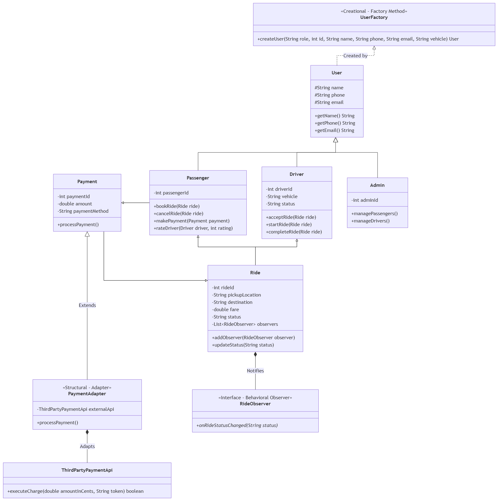
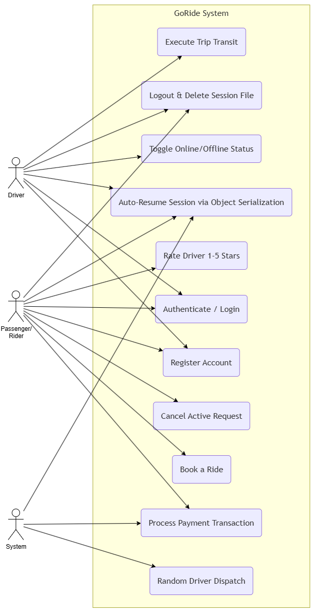
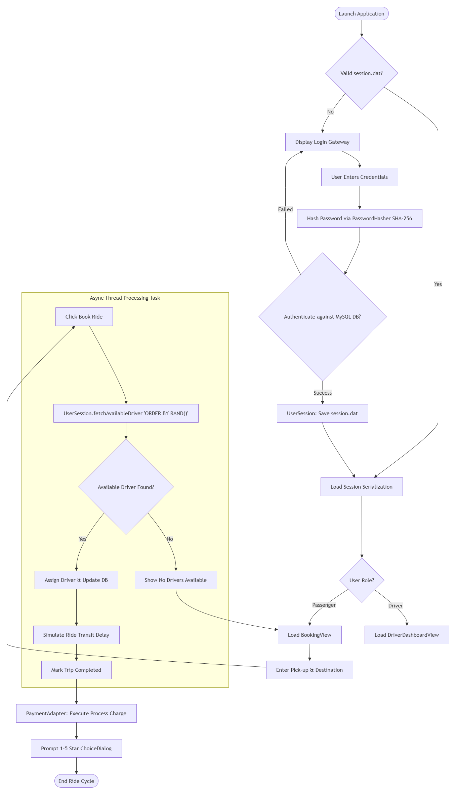
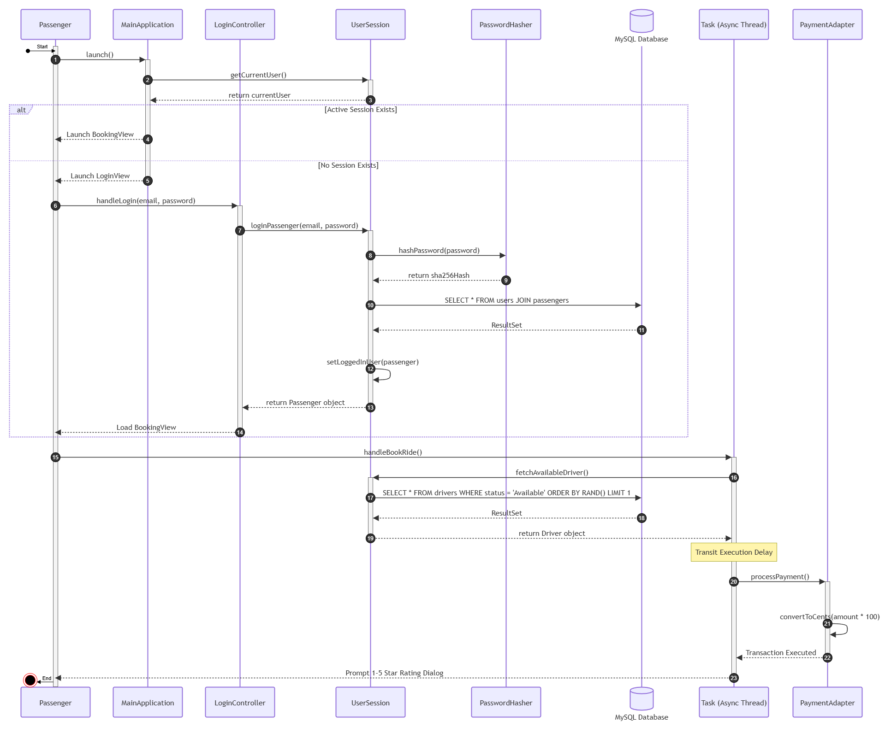

# GoRide - Desktop Ride-Hailing System

**GoRide** is a JavaFX desktop ride-hailing application built in Java. It connects passengers with available drivers using real-time dynamic matching, asynchronous multithreaded trip execution, encrypted authentication, persistent database connectivity, and local user session management via Java Object Serialization.

---

## ✨ Key System Features

* **Multi-Role Authentication Gateway**: Dedicated authentication and interface views tailored for both Passengers and Drivers.
* **ACID Database Transactions**: SQL integration with SHA-256 password hashing for safe user registration and login workflows.
* **Binary Session Persistence**: User sessions dynamically persist locally (`session.dat`) across application restarts using Java Object Serialization.
* **Randomized Driver Dispatch Engine**: Real-time database query engine (`ORDER BY RAND()`) that randomly matches available drivers to distribute dispatches evenly.
* **Interactive 1–5 Star Rating System**: Interactive modal dialog allowing passengers to review and rate drivers upon trip completion.
* **Asynchronous Execution Pipeline**: Multithreaded processing handles trip booking, driver dispatching, live location tracking, fare calculations, and payment processing without freezing the JavaFX UI thread.

---

## 🛠️ Design Patterns Implemented

The architecture incorporates three core software design patterns to ensure scalability, flexibility, and maintainability:

### 1. Creational Pattern: Factory Method
* **Class**: `UserFactory` (`com.example.ridehailing.util.UserFactory`)
* **Description**: Encapsulates object creation logic for instantiating different user role subclasses (`Passenger`, `Driver`, or `Admin`) dynamically based on incoming role parameters without exposing instantiation logic to the client application.

### 2. Structural Pattern: Adapter
* **Class**: `PaymentAdapter` (`com.example.ridehailing.util.PaymentAdapter`)
* **Description**: Adapts the internal domain model `Payment` (calculated in standard dollar format `$`) to interface seamlessly with `ThirdPartyPaymentApi` (which requires charges processed in cents), resolving interface incompatibilities.

### 3. Behavioral Pattern: Observer
* **Classes / Interfaces**: `Ride`, `RideObserver` (`com.example.ridehailing.model`)
* **Description**: Establishes a one-to-many subscription model where `Ride` serves as the Subject. Whenever the ride lifecycle state changes (e.g., from `Requested` to `In Progress` to `Completed`), registered `RideObserver` instances receive automated updates.

---

## 📐 UML Diagrams

> **Note**: Move your exported images (`Class.drawio.png`, `UseCaseCapstone.drawio.png`, `Activity.drawio.png`, `Sequence.drawio.png`) into an `assets/` folder in your project repository root.

### 1. Class Diagram
*Illustrates domain models, design pattern components (`UserFactory`, `PaymentAdapter`, `RideObserver`), and class relationships.*



---

### 2. Use Case Diagram
*Maps interactions between primary actors (Passenger, Driver, Admin) and key system features.*



---

### 3. Activity Diagram
*Details operational execution flow from user authentication and persistent session restoration through trip matching and payment execution.*



---

### 4. Sequence Diagram
*Shows real-time message calls, asynchronous thread execution, database transactions, and component lifelines during a booking lifecycle.*



---

## 🚀 Getting Started & Setup

### Prerequisites
* **Java Development Kit (JDK)**: 17 or higher
* **JavaFX SDK**: Version 17+
* **Database**: MySQL Server (with `goride_db` imported)
* **Build Tool**: Apache Maven

### Database Setup
1. Open your MySQL client (e.g., MySQL Workbench, phpMyAdmin).
2. Import the database schema using `goride_db.sql` provided in the repository:
   ```sql
   SOURCE path/to/goride_db.sql;
